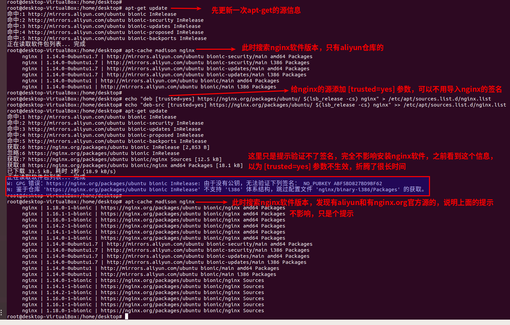

## 国内软件下载仓库，快到感动到流泪

#### maven插件和jar包的阿里云加速仓库配置，很多人都是只配了jar加速器，没配置插件加速器
```
# 在每个项目的pom.xml的配置
  <repositories>
    <repository>
      <id>central</id>
      <name>ali-maven</name>
      <url>http://maven.aliyun.com/nexus/content/groups/public/</url>
    </repository>
  </repositories>
  <pluginRepositories>
    <pluginRepository>
      <id>central</id>
      <name>ali-maven</name>
      <url>http://maven.aliyun.com/nexus/content/groups/public</url>
    </pluginRepository>
  </pluginRepositories>


# 在~/.m2/setting.xml文件的配置
  <mirrors>
    <mirror>
      <id>central</id>
      <mirrorOf>*</mirrorOf>
      <name>Nexus aliyun</name>
      <url>http://maven.aliyun.com/nexus/content/groups/public</url>
    </mirror>
  </mirrors>
  <pluginRepositories>
    <pluginRepository>
      <id>central</id>
      <name>ali-maven</name>
      <url>http://maven.aliyun.com/nexus/content/groups/public</url>
    </pluginRepository>
  </pluginRepositories>
```

* 之前用 apt-key 给Ubuntu添加签名，签名文件是在国外的，结果一个几K的签名文件，一直下载不下载来，折腾了一个晚上。后面直接用 [trusted=yes] 配置参数来相信apt安装源，即使抛出下图的提示信息，提示验证不了签名但不影响使用。  




#### 软件源加速仓库
* Centos
```
curl -o /etc/yum.repos.d/CentOS-Base.repo http://mirrors.aliyun.com/repo/Centos-7.repo
sed -i "/mirrors.aliyuncs.com/d"  /etc/yum.repos.d/CentOS-Base.repo
sed -i "/mirrors.cloud.aliyuncs.com/d"  /etc/yum.repos.d/CentOS-Base.repo
yum clean all
yum makecache

```
* Ubuntu
```
echo "deb http://mirrors.aliyun.com/ubuntu/ $(lsb_release -cs) main restricted universe multiverse" > /etc/apt/sources.list
echo "deb http://mirrors.aliyun.com/ubuntu/ $(lsb_release -cs)-security main restricted universe multiverse" >> /etc/apt/sources.list
echo "deb http://mirrors.aliyun.com/ubuntu/ $(lsb_release -cs)-updates main restricted universe multiverse" >> /etc/apt/sources.list
echo "deb http://mirrors.aliyun.com/ubuntu/ $(lsb_release -cs)-proposed main restricted universe multiverse" >> /etc/apt/sources.list
echo "deb http://mirrors.aliyun.com/ubuntu/ $(lsb_release -cs)-backports main restricted universe multiverse" >> /etc/apt/sources.list
apt-get update && apt-get clean && apt-get autoclean

```

#### docker仓库
* Centos
```
yum-config-manager --add-repo http://mirrors.aliyun.com/docker-ce/linux/centos/docker-ce.repo
yum clean all
yum makecache
yum install -y docker-ce

```
* Ubuntu
```
# 用root用户安装
mkdir -p /etc/apt/sources.list.d
echo "deb [arch=amd64 trusted=yes] https://mirrors.ustc.edu.cn/docker-ce/linux/ubuntu $(lsb_release -cs) stable" > /etc/apt/sources.list.d/aliyun-docker.list
# curl -fsSL https://mirrors.aliyun.com/docker-ce/linux/ubuntu//gpg | apt-key add -
apt-get update && apt-get clean && apt-get autoclean
apt-get install -y docker-ce
mkdir -p /etc/docker
tee /etc/docker/daemon.json <<-'EOF'
{
  "registry-mirrors": ["https://kfp63jaj.mirror.aliyuncs.com"]
}
EOF
systemctl enable docker #设置docker服务开机自启动
systemctl restart docker

```

#### docker-compose的github下载地址，暂时没找到国内加速仓库
```
# https://github.com/docker/compose/releases
# ALL_PROXY=socks5://127.0.0.1:1080 curl -L https://github.com/docker/compose/releases/download/1.25.5/docker-compose-`uname -s`-`uname -m` > /usr/local/bin/docker-compose
curl -L https://get.daocloud.io/docker/compose/releases/download/1.26.2/docker-compose-`uname -s`-`uname -m` > /usr/local/bin/docker-compose
chmod +x /usr/local/bin/docker-compose
```


#### virtualBox
* Centos
```
rm -rf /etc/yum.repos.d/virtualbox.repo
tee /etc/yum.repos.d/virtualbox.repo <<-'EOF'
[virtualbox]
name=Virtualbox Repository
baseurl=http://mirrors.cloud.tencent.com/virtualbox/rpm/el$releasever/
gpgcheck=0
enabled=1
EOF

sudo yum makecache
# sudo yum install VirtualBox-5.1
sudo yum install VirtualBox-5.2

```
* Ubuntu
```
# 经历过无尽的痛苦，曾经有段时间，完全访问不了nodesource.gpg.key，导致 apt-get update 更新源时，老是提示验证不了签名，又不想手动添加那个签名，因为这个对于自动化就是无法逾越的鸿沟，因此只能给源添加 [trusted=yes] 属性
# 添加 Oracle virtualbox 公钥
# wget -q https://www.virtualbox.org/download/oracle_vbox_2016.asc -O- | sudo apt-key add -

mkdir -p /etc/apt/sources.list.d
# 使用腾讯云的软件仓库地址
sudo echo "deb [trusted=yes] http://mirrors.cloud.tencent.com/virtualbox/apt/ $(lsb_release -sc) contrib" > /etc/apt/sources.list.d/virtualbox.list
apt-get update
apt-get install -y virtualbox-5.2
# 设置 virtualbox 内核模块开机启动
systemctl enable vboxdrv
systemctl restart vboxdrv
# sudo usermod -aG vboxusers 用户名

```

#### vagrant.box国内下载地址
```
# ubuntu的国内加速下载地址
curl -L https://mirrors.tuna.tsinghua.edu.cn/ubuntu-cloud-images/bionic/current/bionic-server-cloudimg-amd64-vagrant.box > 18.04-bionic-server-cloudimg-amd64-vagrant.box
curl -L https://mirrors.tuna.tsinghua.edu.cn/ubuntu-cloud-images/xenial/current/xenial-server-cloudimg-amd64-vagrant.box > 16.04-xenial-server-cloudimg-amd64-vagrant.box
curl -L https://mirrors.tuna.tsinghua.edu.cn/ubuntu-cloud-images/focal/current/focal-server-cloudimg-amd64-vagrant.box > 20.04-focal-server-cloudimg-amd64-vagrant.box

# centos的国内加速下载地址
https://mirrors.ustc.edu.cn/centos-cloud/centos/7/vagrant/x86_64/images/
# curl -L https://mirrors.ustc.edu.cn/centos-cloud/centos/7/vagrant/x86_64/images/CentOS-7-x86_64-Vagrant-1809_01.VirtualBox.box > CentOS-7-x86_64-Vagrant-1809_01.VirtualBox.box
# curl -L https://mirrors.ustc.edu.cn/centos-cloud/centos/7/vagrant/x86_64/images/CentOS-7-x86_64-Vagrant-1811_01.VirtualBox.box > CentOS-7-x86_64-Vagrant-1811_01.VirtualBox.box
# curl -L https://mirrors.ustc.edu.cn/centos-cloud/centos/7/vagrant/x86_64/images/CentOS-7-x86_64-Vagrant-1901_01.VirtualBox.box > CentOS-7-x86_64-Vagrant-1901_01.VirtualBox.box

```

#### 安装 12.X 版本的nodejs，然后切换回普通用户安装插件
```
# 经历过无尽的痛苦，曾经有段时间，完全访问不了nodesource.gpg.key，导致 apt-get update 更新nodejs源时，老是提示验证不了签名，又不想手动添加那个签名，因为这个对于自动化就是无法逾越的鸿沟，因此只能给源添加 [trusted=yes] 属性
# 下面这句一定要运行，否则会认为nodejs的仓库地址是不可信，导致不能下载安装nodejs软件
# curl -s https://deb.nodesource.com/gpgkey/nodesource.gpg.key | sudo apt-key add -

mkdir -p /etc/profile.d
echo "#set npm environment" > /etc/profile.d/npm-config.sh
echo 'export PATH=~/.npm-global/bin:$PATH' >> /etc/profile.d/npm-config.sh
chmod 755 /etc/profile.d/npm-config.sh

echo "deb [arch=amd64 trusted=yes] https://mirrors.tuna.tsinghua.edu.cn/nodesource/deb_12.x $(lsb_release -cs) main" > /etc/apt/sources.list.d/nodesource.list
echo "deb-src [arch=amd64 trusted=yes] https://mirrors.tuna.tsinghua.edu.cn/nodesource/deb_12.x $(lsb_release -cs) main" >> /etc/apt/sources.list.d/nodesource.list
apt-get update
apt-get install -y nodejs

# 修改 npm 安装插件的目录是 当前用户的 ~/.npm-global目录, 切回普通用户执行下面命令
npm config set prefix '~/.npm-global'

# 配置国内加速器
source /etc/profile
npm config set registry https://registry.npm.taobao.org --verbose
npm install -g cnpm --registry=https://registry.npm.taobao.org --verbose
npm install -g yarn --verbose
yarn config set registry https://registry.npm.taobao.org/

# 部分软件单独设置加速地址
npm config set registry https://registry.npm.taobao.org
npm config set sass_binary_site https://npm.taobao.org/mirrors/node-sass/
npm config set phantomjs_cdnurl https://npm.taobao.org/mirrors/phantomjs/
npm config set electron_mirror https://npm.taobao.org/mirrors/electron/
npm config set sqlite3_binary_host_mirror https://npm.taobao.org/mirrors/sqlite3/
npm config set profiler_binary_host_mirror https://npm.taobao.org/mirrors/node-inspector/
npm config set chromedriver_cdnurl https://npm.taobao.org/mirrors/chromedriver/
npm config set puppeteer_download_host=https://npm.taobao.org/mirrors/

yarn config set registry https://registry.npm.taobao.org
yarn config set sass_binary_site https://npm.taobao.org/mirrors/node-sass/
yarn config set phantomjs_cdnurl https://npm.taobao.org/mirrors/phantomjs/
yarn config set electron_mirror https://npm.taobao.org/mirrors/electron/
yarn config set sqlite3_binary_host_mirror https://npm.taobao.org/mirrors/sqlite3/
yarn config set profiler_binary_host_mirror https://npm.taobao.org/mirrors/node-inspector/
yarn config set chromedriver_cdnurl https://npm.taobao.org/mirrors/chromedriver/
yarn config set puppeteer_download_host=https://npm.taobao.org/mirrors/

```

#### VBoxGuestAdditions_x.x.xx.iso版本下载
```
# 在浏览器去到下面地址下载，找到与virtualBox对应的版本
https://mirrors.tuna.tsinghua.edu.cn/virtualbox
```

#### pip使用国内阿里云软件源
```
mkdir -p ~/.pip
echo "[global]" > ~/.pip/pip.conf
echo "index-url=http://mirrors.aliyun.com/pypi/simple/" >> ~/.pip/pip.conf

echo "[install]" >> ~/.pip/pip.conf
echo "trusted-host=mirrors.aliyun.com" >> ~/.pip/pip.conf
cat ~/.pip/pip.conf

```

### vagrant
* Ubuntu
```
# 网上的人说 sudo apt-get install vagrant -y 不支持VirtualBox 5.2版，所以要去官网手动下载安装vagrant二进制包
# 官网下载页 https://www.vagrantup.com/downloads.html
# 安装2.2.4版本
wget https://releases.hashicorp.com/vagrant/2.2.4/vagrant_2.2.4_x86_64.deb
dpkg -i vagrant_2.2.4_x86_64.deb
# sudo apt-get install -f -y        # 自动修复包的依赖
sudo apt --fix-broken -y install    # 自动修复包的依赖
dpkg -i vagrant_2.2.4_x86_64.deb
```

#### kernel内核仓库
[香港内核仓库http://hkg.mirror.rackspace.com/elrepo/kernel/el7/x86_64/RPMS/](http://hkg.mirror.rackspace.com/elrepo/kernel/el7/x86_64/RPMS/)  
[清华大学内核仓库https://mirrors.tuna.tsinghua.edu.cn/elrepo/kernel/el7/x86_64/RPMS/](https://mirrors.tuna.tsinghua.edu.cn/elrepo/kernel/el7/x86_64/RPMS/)  
[中国科技大学内核仓库http://mirrors.ustc.edu.cn/elrepo/kernel/el7/x86_64/RPMS/](http://mirrors.ustc.edu.cn/elrepo/kernel/el7/x86_64/RPMS/)  
[内核仓库http://elrepo.reloumirrors.net/kernel/el7/x86_64/RPMS/](http://elrepo.reloumirrors.net/kernel/el7/x86_64/RPMS/)  
[内核仓库http://elrepo.org/linux/kernel/el7/x86_64/RPMS/](http://elrepo.org/linux/kernel/el7/x86_64/RPMS/)  
[内核仓库http://ftp.colocall.net/pub/elrepo/archive/kernel/el6/x86_64/RPMS/](http://ftp.colocall.net/pub/elrepo/archive/kernel/el6/x86_64/RPMS/)  
```
rpm --import https://www.elrepo.org/RPM-GPG-KEY-elrepo.org
rpm -Uvh https://mirrors.tuna.tsinghua.edu.cn/elrepo/kernel/el7/x86_64/RPMS/elrepo-release-7.0-4.el7.elrepo.noarch.rpm
yum --enablerepo=elrepo-kernel install kernel-lt -y
# 查看当前默认内核
grub2-editenv list
# 查看所有内核版本
awk -F\' '$1=="menuentry " {print $2}' /etc/grub2.cfg
# 设置刚刚安装的内核版本启动顺序为第一
grub2-set-default 0

```

#### nginx版本
* Centos7
```
rpm -Uvh http://nginx.org/packages/centos/7/noarch/RPMS/nginx-release-centos-7-0.el7.ngx.noarch.rpm
yum install -y nginx

```
* Ubuntu
```
mkdir -p /etc/apt/sources.list.d
echo "deb [trusted=yes] https://nginx.org/packages/ubuntu/ $(lsb_release -cs) nginx" > /etc/apt/sources.list.d/nginx.list
echo "deb-src [trusted=yes] https://nginx.org/packages/ubuntu/ $(lsb_release -cs) nginx" >> /etc/apt/sources.list.d/nginx.list
# apt-key adv --keyserver keyserver.ubuntu.com --recv-keys ABF5BD827BD9BF62
apt-get update
apt-get install -y nginx

```


#### aliyun有Ubuntu版本的postgresql的仓库
* http://mirrors.aliyun.com/ubuntu/pool/main/p/
* http://mirrors.aliyun.com/ubuntu/pool/main/p/postgresql-12/