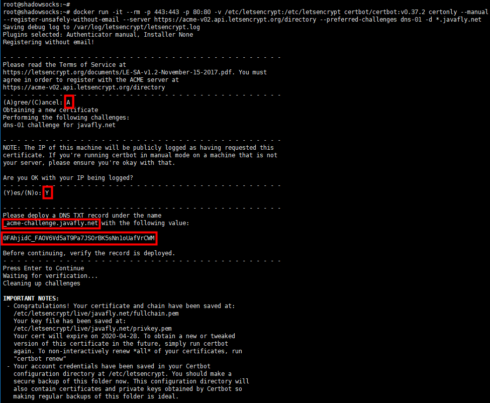
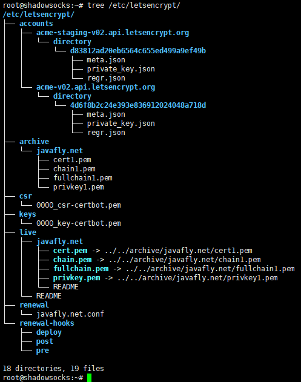
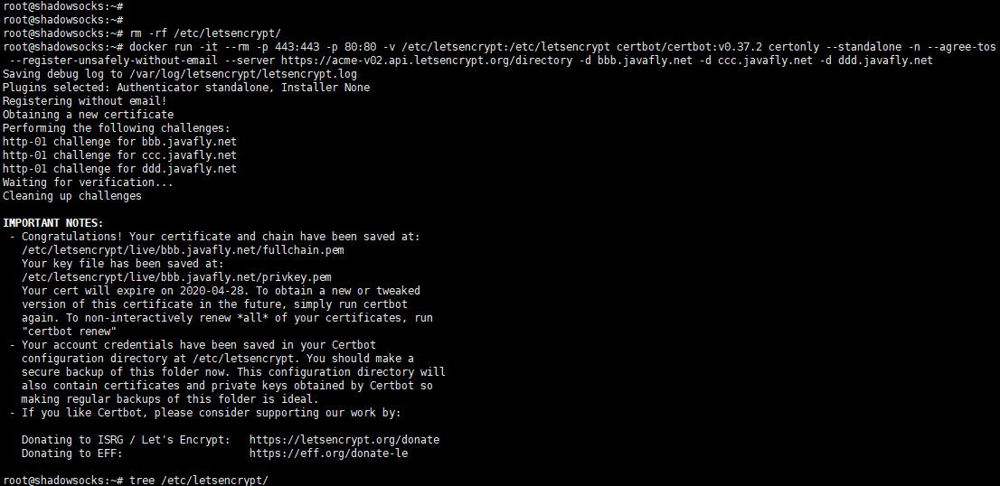

### 亲测生成证书的命令

## 做下面的东西时扑街了，搞死人都搞不了，以后不要浪费生命去搞了，生命太宝贵了
* 通配符证书测试证书续期时，加上 --dry-run 参数就会扑街，会搞死人的，做不了免交互，真的很难用，每次都要手动操作，去掉 --dry-run 参数后可以
```
docker run -it --rm -p 443:443 -p 80:80 -v /etc/letsencrypt:/etc/letsencrypt certbot/certbot:v0.37.2 renew --manual --preferred-challenges dns --dry-run
```


#### 查看 /etc/letsencrypt 有多少证书，包括通配符证书和普通证书
```
docker run -it --rm -p 443:443 -p 80:80 -v /etc/letsencrypt:/etc/letsencrypt certbot/certbot:v0.37.2 certificates
```


* 首次使用通配符，避免不了手动交互，必须添加一条 TXT 记录到 _acme-challenge.域名 来证明该域名是属于当前用户的
* 以后新的网站全部用通配符域名，除了历史遗留的域名和问题
* 通配符证书用 --manual 参数
* --manual：表示插件
* 不要添加 -n --agree-tos 参数，通配符域名不支持这些免交互的参数
* -n 非交互式，因此 -n 与 --agree-tos 必须一起用
* --agree-tos 同意服务协议
```
# 测试命令
docker run -it --rm -p 443:443 -p 80:80 -v /etc/letsencrypt:/etc/letsencrypt certbot/certbot:v0.37.2 certonly --manual --register-unsafely-without-email --server https://acme-v02.api.letsencrypt.org/directory --preferred-challenges dns-01 -d *.javafly.net --dry-run
# 其中需要好几次手动回车确认，其中还有一个手动添加 TXT 记录到 域名记录商来证明该域名

# 正式命令
docker run -it --rm -p 443:443 -p 80:80 -v /etc/letsencrypt:/etc/letsencrypt certbot/certbot:v0.37.2 certonly --manual --register-unsafely-without-email --server https://acme-v02.api.letsencrypt.org/directory --preferred-challenges dns-01 -d *.javafly.net

# 禁止copy，防止翻车

mkdir -p nginx/conf.d
tee nginx/conf.d/aaa.javafly.net.conf <<-'EOF'
server {
      listen       80;
      # 阿里的ant-design-pro给出的nginx静态资源部署建议 # 如果有资源，建议使用 https + http2，配合按需加载可以获得更好的体验
      listen  443  ssl  http2 default_server;
      server_name  aaa.javafly.net;

      ssl_certificate /etc/letsencrypt/live/javafly.net/fullchain.pem;
      ssl_certificate_key /etc/letsencrypt/live/javafly.net/privkey.pem;
      ssl_trusted_certificate /etc/letsencrypt/live/javafly.net/chain.pem;

      location / {
            root   /usr/share/nginx/html;
            index  index.html index.htm;
      }
}
EOF

docker run -itd --restart always --name nginx -e TZ=Asia/Shanghai -p 80:80 -p 443:443 -v /etc/localtime:/etc/localtime:ro -v /etc/letsencrypt:/etc/letsencrypt -v $PWD/nginx/conf.d/:/etc/nginx/conf.d/ nginx:1.15.4-alpine

# 然后通过域名访问根路径  https://aaa.javafly.net

# 通配符域名续期的要交互输入一条TXT的nds记录来证明该域名是属于当前用户的，所以做自动化很头痛
docker run -it --rm -p 443:443 -p 80:80 -v /etc/letsencrypt:/etc/letsencrypt certbot/certbot:v0.37.2 renew --manual --preferred-challenges dns
docker run -it --rm -p 443:443 -p 80:80 -v /etc/letsencrypt:/etc/letsencrypt certbot/certbot:v0.37.2 certificates
docker run -it --rm -p 443:443 -p 80:80 -v /etc/letsencrypt:/etc/letsencrypt certbot/certbot:v0.37.2 renew --manual --preferred-challenges dns --cert-name javafly.net 

```
### 截图证明
* 截图1  


* 截图2  


* 亲测，用certbot/certbot:v0.37.2版本加多个-d域名参数，发现只有第一个域名参数生成证书，其他的域名没有生成证书，放弃挣扎，以后都是一个证书一个证书生成，不知道网上写博客的人，有没有测试过，或许是我的版本不对，没有生成多个域名证书
* 使用 --standalone 方式, 要占用443端口, 所以先把443端口的服务停止
* --standalone参数的方式是常用的方式，当内网的服务器无法被letsencrypt的服务器访问到时，当不知道网站的根目录在哪里或者是网站根目录不在当前机器时
* 好无奈的现实，发现低版本v0.26.1的certbot的 --dry-run 参数不能用，导致做不了自动化，本身对certbot就不熟，出错后完全不知道怎么搞
> > 在 2018年6月份的时候，certbot/certbot:v0.26.1 版本可以加 --dry-run 参数
>>  但是到了 2020年01月28号时，再用该版本 certbot/certbot:v0.26.1 加 --dry-run 参数，出错了 An unexpected error occurred: The request message was malformed :: Method not allowed
>> 此时用 certbot/certbot:v0.37.2 版本加 --dry-run 参数，却不抛错


```
mkdir -p /etc/letsencrypt
# 单个域名测试命令
# docker run -it --rm -p 443:443 -p 80:80 -v /etc/letsencrypt:/etc/letsencrypt certbot/certbot:v0.37.2 certonly --standalone -n --agree-tos --register-unsafely-without-email --server https://acme-v02.api.letsencrypt.org/directory -d ddd.javafly.net --dry-run
# 单个域名的命令
docker run -it --rm -p 443:443 -p 80:80 -v /etc/letsencrypt:/etc/letsencrypt certbot/certbot:v0.37.2 certonly --standalone -n --agree-tos --register-unsafely-without-email --server https://acme-v02.api.letsencrypt.org/directory -d ddd.javafly.net

docker run -itd --restart always --name nginx -e TZ=Asia/Shanghai -p 80:80 -p 443:443 -v /etc/localtime:/etc/localtime:ro -v /etc/letsencrypt:/etc/letsencrypt nginx:1.15.4-alpine

# 不能连续copy,否则会翻车

tee aaa.javafly.net.conf <<-'EOF'
server {
      listen       80;
      # 阿里的ant-design-pro给出的nginx静态资源部署建议 # 如果有资源，建议使用 https + http2，配合按需加载可以获得更好的体验
      listen  443  ssl  http2 default_server;
      server_name  aaa.javafly.net;

      ssl_certificate /etc/letsencrypt/live/aaa.javafly.net/fullchain.pem;
      ssl_certificate_key /etc/letsencrypt/live/aaa.javafly.net/privkey.pem;
      ssl_trusted_certificate /etc/letsencrypt/live/aaa.javafly.net/chain.pem;

      location / {
            root   /usr/share/nginx/html;
            index  index.html index.htm;
      }
}
EOF
docker cp aaa.javafly.net.conf nginx:/etc/nginx/conf.d
docker restart nginx
# 然后通过域名访问根路径  https://aaa.javafly.net


# 域名续期的测试命令
docker run -it --rm -p 443:443 -p 80:80 -v /etc/letsencrypt:/etc/letsencrypt certbot/certbot:v0.37.2 renew --dry-run
# 域名续期的命令，/etc/letsencrypt目录下的所有域名都会被续期
docker run -it --rm -p 443:443 -p 80:80 -v /etc/letsencrypt:/etc/letsencrypt certbot/certbot:v0.37.2 renew
```

### 在certbot/certbot:v0.37.2版本测试，多个域名参数无效，只生成第一个域名参数的证书
```
docker run -it --rm -p 443:443 -p 80:80 -v /etc/letsencrypt:/etc/letsencrypt certbot/certbot:v0.37.2 certonly --standalone -n --agree-tos --register-unsafely-without-email --server https://acme-v02.api.letsencrypt.org/directory -d bbb.javafly.net -d ccc.javafly.net -d ddd.javafly.net

# 对/etc/letsncrypt目录所有域名证书进行续期，有通配符证书的话，会失效，通配符证书必须要有交互
docker run -it --rm -p 443:443 -p 80:80 -v /etc/letsencrypt:/etc/letsencrypt certbot/certbot:v0.37.2
# 对指定域名证书进行续期
docker run -it --rm -p 443:443 -p 80:80 -v /etc/letsencrypt:/etc/letsencrypt certbot/certbot:v0.37.2 renew --cert-name aaa.javafly.net 
```
### 截图证明
* 截图1  


* 截图2  



### 通配符证书
* 首次使用通配符，避免不了手动交互，必须添加一条 TXT 记录到 _acme-challenge.域名 来证明该域名是属于该用户的
* 目前 Let’s Encrypt 只支持同级子域名通配符。例如 *.demo.com 只支持 xx.demo.com 这类的，而不支持 xx.xx.demo.com。
* 而要支持二级通配符需要再次颁发二级通配符证书，类似 *.demo.demo.com。
* 这种的二级通配符，要求一级域名是固定的。意思是不支持 *.*.demo.com。
```
```

