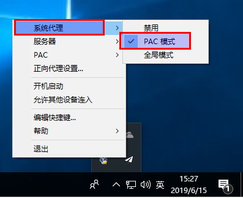

# 列出完整的真实示例，下面的例子部署后，成功访问谷歌。因为搭过很多次，发现有些时候可以，有些时候不行，不知道是不是被墙了，还是命令参数出错了，搞到我很懵逼。因为命令参数这么多，网上博客又不说参数是什么意思，全部靠蒙的，蒙对了就对了，完全不知道什么意思。出错了，不知道是命令问题，还是被墙了。不知道命令参数什么意思，只能用事实说话。

* 客户端下载地址 https://github.com/shadowsocks/shadowsocks-windows/releases

* 在全局模式下，所有的网站都默认走代理（所有http/socks数据经过代理服务器的转发送出）
* 在PAC模式下，只有被墙了的网站才会走代理（连接网站的时候读取PAC文件里的规则，来确定你访问的网站有没有被墙，如果符合，那就会使用代理服务器连接网站）。  
  
### 例子一，用服务器的6443端口，好像网速很慢，难道针对6443端口，会被墙得厉害，不知道是不是错觉
> 服务端的操作。在外国服务器运行下面的命令
```
docker run --restart always -itd --name ssserver -p 6443:6443 -p 6500:6500/udp mritd/shadowsocks:3.2.3 -m "ss-server" -s "-s 0.0.0.0 -p 6443 -m aes-256-cfb -k shadowsocks654321" -x -e "kcpserver" -k "-t 127.0.0.1:6443 -l :6500 -mode fast2"
```

> Windows客户端的操作截图
* 步骤一: 鼠标右键小飞机图标，依次操作 "服务器" -> "编辑服务器" -> 输入服务器信息 -> 保存
* 步骤二: 鼠标右键小飞机图标，依次点击 "系统代理" -> "PAC模式"
  
  
  
  

* windows 下 shadowsocks-windows 客户端的配置，配置完之后，可以直接访问 www.google.com

<br><br><br><br><br>
### 例子二，用服务器的非6443端口，会比6443端口快，不知道是不是错觉
```
docker run --restart always -itd --name ssserver -p 12354:6443 -p 6500:6500/udp mritd/shadowsocks:3.2.3 -m "ss-server" -s "-s 0.0.0.0 -p 6443 -m aes-256-cfb -k shadowsocks654321" -x -e "kcpserver" -k "-t 127.0.0.1:6443 -l :6500 -mode fast2"
```
